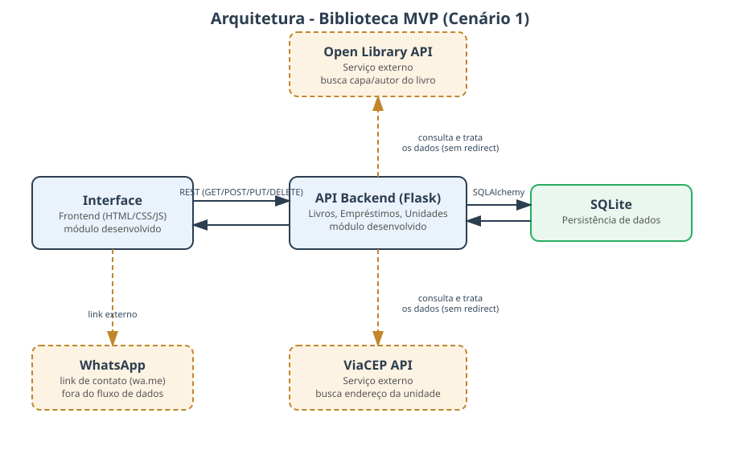

# Biblioteca MVP - Backend (API)

Este é o backend do sistema de biblioteca, desenvolvido utilizando Python e o framework Flask. Sua principal função é gerenciar o banco de dados (SQLite), fornecer uma API para o frontend da aplicação e consumir os serviços externos usados pelo sistema.

## Arquitetura



A API Backend recebe as chamadas REST da Interface (repositório [BibliotecaV1_FRONT](https://github.com/Maic2018/BibliotecaV1_FRONT)), persiste os dados em SQLite e consulta duas APIs externas: **Open Library** (dados/capa de livros) e **ViaCEP** (endereço das unidades da biblioteca).

## Tecnologias Utilizadas

- **Linguagem:** Python 3.x
- **Framework Web:** Flask
- **Banco de Dados:** SQLite
- **Documentação da API:** Flasgger (Swagger)
- **Integração externa:** biblioteca `requests` para consumir Open Library e ViaCEP
- **Controle de Ambiente:** venv (ambiente virtual Python)
- **Gerenciamento de Dependências:** requirements.txt (pip)
- **Outras dependências:** Flask-SQLAlchemy, Flask-Cors, Werkzeug, etc.

## Como rodar a aplicação

### Opção 1: Ambiente virtual Python

```bash
cd backend
python -m venv ../venv
```

Ative o ambiente virtual:
- **No Windows:** `..\venv\Scripts\Activate`
- **No Mac/Linux:** `source ../venv/bin/activate`

Instale as dependências e inicie o servidor:

```bash
pip install -r requirements.txt
python app.py
```

Pronto! A API estará rodando em `http://localhost:5000`.

### Opção 2: Via Docker

Com o Docker instalado, na raiz deste repositório:

```bash
docker build -t biblioteca-backend .
docker run -d -p 5000:5000 biblioteca-backend
```

---

## Documentação da API (Swagger)

Com o servidor rodando, você pode visualizar e testar todos os endpoints acessando pelo navegador:
**[http://localhost:5000/apidocs]**

## Usuários Padrão

Ao rodar o projeto pela primeira vez, dois usuários são criados automaticamente no banco de dados para facilitar seus testes:

- **Administrador:**
  - Login: `admin`
  - Senha: `admin123`
- **Usuário Comum:**
  - Login: `user`
  - Senha: `user123`

## Principais Rotas

| Método | Rota | Descrição | Acesso |
|---|---|---|---|
| POST | `/api/login` | Valida credenciais | Público |
| GET | `/api/books` | Lista livros | Público |
| POST | `/api/books` | Cadastra livro | Admin |
| PUT | `/api/books/<id>` | Edita livro | Admin |
| DELETE | `/api/books/<id>` | Remove livro | Admin |
| POST | `/api/books/<id>/borrow` | Empresta livro | Usuário logado |
| POST | `/api/books/<id>/return` | Devolve livro | Usuário logado |
| GET | `/api/books/external-lookup?title=` | Busca autor/capa na Open Library | Admin |
| GET | `/api/units` | Lista unidades da biblioteca | Público |
| POST | `/api/units` | Cadastra unidade (busca endereço via ViaCEP) | Admin |
| PUT | `/api/units/<id>` | Edita unidade | Admin |
| DELETE | `/api/units/<id>` | Remove unidade | Admin |

## APIs Externas Utilizadas

### 1. Open Library (https://openlibrary.org)
- **Uso:** ao cadastrar um livro, o admin pode buscar automaticamente o autor e a URL da capa a partir do título.
- **Licença/cadastro:** serviço público e gratuito, sem necessidade de cadastro ou chave de API.
- **Rotas consumidas:**
  - `GET https://openlibrary.org/search.json?q={titulo}&limit=1`
  - `GET https://covers.openlibrary.org/b/id/{cover_id}-L.jpg`
- **Implementação:** `external_services.py` → classe `OpenLibraryClient`, usada em `services.py` → `BookService.lookup_external_info`, exposta na rota `GET /api/books/external-lookup`.
- Os dados retornados (texto e URL de imagem) são tratados e devolvidos em JSON pela própria API — o usuário nunca é redirecionado para o site da Open Library.

### 2. ViaCEP (https://viacep.com.br)
- **Uso:** ao cadastrar ou editar uma unidade da biblioteca, o admin informa apenas o CEP, e o endereço completo (logradouro, bairro, cidade, UF) é preenchido automaticamente.
- **Licença/cadastro:** serviço público e gratuito, sem necessidade de cadastro ou chave de API.
- **Rota consumida:** `GET https://viacep.com.br/ws/{cep}/json/`
- **Implementação:** `external_services.py` → classe `ViaCepClient`, usada em `services.py` → `UnitService`, exposta nas rotas `POST /api/units` e `PUT /api/units/<id>`.
- O endereço retornado é salvo no banco de dados e exibido na aplicação — o usuário nunca é redirecionado para o site do ViaCEP.
